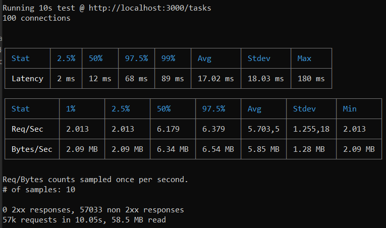

## Análise de performance básica

Para realizar uma análise de performance, foi realizado um teste de carga simples.

### Teste de carga

Aqui o objetivo é simular múltiplos usuários acessando a API ao mesmo tempo para ver como ela se comporta sob estresse.

Foi utilizada a ferramenta de teste de carga chamada Autocannon, por meio dos passos a seguir:
- Com a API rodando localmente (http://localhost:3000), foi aberto um novo terminal.
- Foi executado o comando abaixo para simular 100 conexões simultâneas por 10 segundos no seu endpoint **/tasks**:
`npx autocannon -c 100 -d 10 http://localhost:3000/tasks`

O que observar no resultado:

- **Req/s (Requests per second)**: o mais importante. Mostra quantas requisições sua API aguentou por segundo, em média.
- **Latency (Latência)**: ,ostra a média, mínimo e máximo do tempo de resposta sob carga. Se a latência média aumentar muito durante o teste, é um sinal de que sua API está sobrecarregada.
- **2xx responses**: O número de respostas com sucesso. Deve ser igual ao total de requisições. Se aparecerem erros (4xx, 5xx), sua API está falhando sob carga.

**Resultado**
O resultado abaixo do Autocannon evidencia que a API está falhando sob carga, pois nenhuma das quase 50.000 requisições foi bem-sucedida. Apesar de os números de performance parecerem bons, eles medem a velocidade com que o servidor retornou um erro. 

A informação mais crítica é que foi obtida zero respostas de sucesso. A aplicação não aguenta a carga de 100 conexões simultâneas e quebra imediatamente. Os números de latência e vazão que você vê são enganosos, pois medem a performance de respostas de erro, que geralmente são muito mais rápidas de gerar do que respostas de sucesso (que podem envolver consultas a banco de dados, etc.).

## Limitações arquiteturais

O servidor criado segue uma arquitetura monolítica tradicional. Mesmo sendo simples e eficaz para muitos cenários, ela possui limitações importantes, principalmente conforme a aplicação cresce.

As principais limitações arquiteturais são:

1. Escalabilidade vertical e Ponto Único de Falha (SPOF)
Se o servidor Node.js travar por qualquer motivo (um erro não tratado, por exemplo), toda a aplicação fica offline. Não há redundância. É o exemplo observado no teste de carga acima. Com 100 conexões ao banco de dado, a aplicação não aguenta e cai.

Nesse caso, o que está acontecendo é que **a arquitetura opera em um único processo**. Para lidar com mais carga, a solução principal é a escalabilidade vertical, ou seja, adicionar mais CPU e memória à máquina onde o servidor roda. Isso é caro e tem um limite físico.

2. Limitações do cache em Memória
O cache em memória, embora rápido, apresenta desvantagens significativas em um ambiente de produção que precise crescer. 

No caso do servidor construído, que roda localmente, o ponto mais visível é a volatilidade, ou seja, **quando o servidor reinicia, todo o cache é perdido**. Isso causa um pico de carga no banco de dados, pois todas as requisições subsequentes precisarão buscar os dados novamente, podendo sobrecarregar o banco.

Outro ponto que não foi notado no projeto local mas que pode ser um problema em ambientes de produção é que o **cache em memória não é escalável**. O cache está limitado à memória RAM da máquina do servidor. Se o volume de dados a ser cacheado crescer muito, ele pode esgotar a memória disponível para a aplicação.

3. Acoplamento de componentes
Em uma arquitetura monolítica, todos os componentes (autenticação JWT, lógica de negócio, acesso ao banco de dados, etc.) estão fortemente acoplados no mesmo código-base.

**Uma mudança em uma pequena parte do sistema pode ter efeitos inesperados em outras partes**, exigindo testes extensivos. Com o tempo, o código se torna mais difícil de entender e modificar.

Além disso, outro ponto importante é que **a tecnologia fica "presa"**, ou seja, é muito difícil atualizar ou substituir uma parte da tecnologia (ex: trocar o sistema de logging ou o banco de dados) sem impactar toda a aplicação. A arquitetura inteira precisa ser compatível com uma única pilha tecnológica.

4. Conclusão

Em resumo, a arquitetura do servidor tradicional é excelente para início de projetos e APIs simples, mas suas principais limitações giram em torno da dificuldade de escalar horizontalmente, da falta de resiliência (ponto único de falha) e das inconsistências geradas pelo cache em memória quando se tenta crescer além de uma única instância.