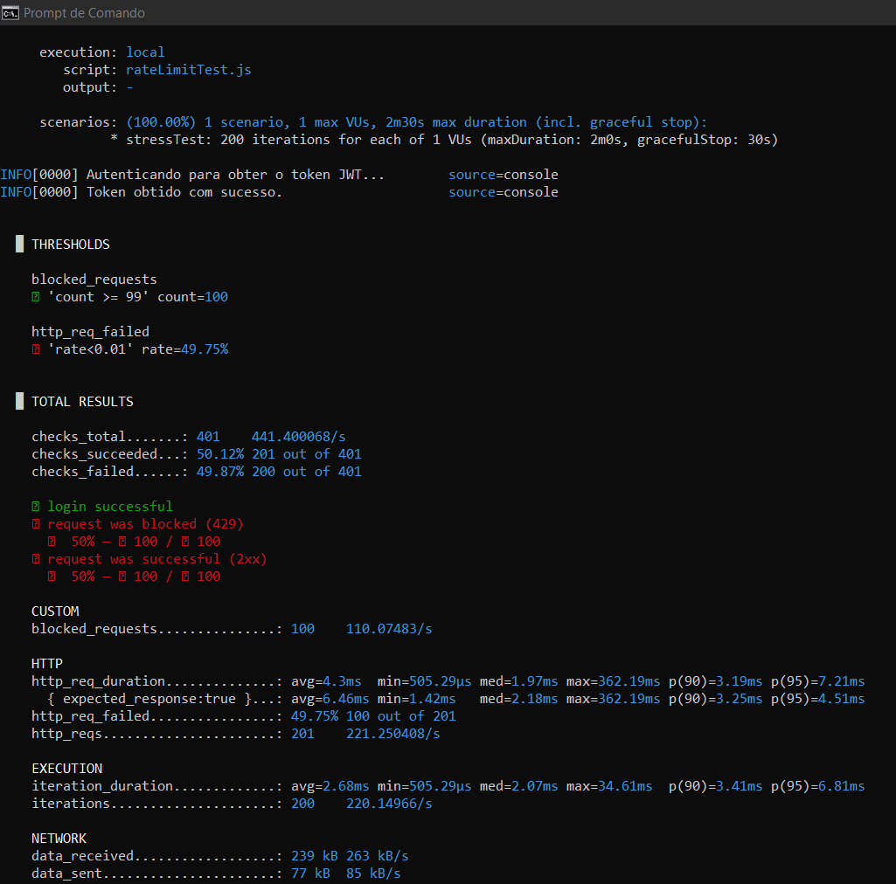

## Teste de estresse
O teste que vamos criar simula um único usuário autenticado tentando deliberadamente ultrapassar o limite de 100 requisições para verificar se o sistema se comporta como esperado.

### Metodologia
Usaremos uma ferramenta chamada k6. Ela é perfeita para isso, pois nos permite escrever o cenário de teste em JavaScript, lidar com autenticação (essencial para a nossa aplicação) e verificar as respostas.

**Plano de teste**
- Fase 1 (Autenticação): antes de tudo, o script fará uma única requisição a um endpoint de login para obter um token JWT válido.
- Fase 2 (Ataque): o script usará esse token para disparar um número de requisições bem acima do seu limite (ex: 200 requisições) o mais rápido possível contra uma rota protegida.
- Fase 3 (Verificação): durante o "ataque", vamos verificar cada resposta:
As primeiras 100 requisições devem retornar um status de sucesso (ex: 200 OK).
A partir da 101ª requisição, o servidor deve começar a responder com 429 Too Many Requests.

**Ferramentas necessárias**
- Node.js
- [k6](https://github.com/grafana/k6/releases): ferramenta de teste de carga
- Script apresentado no caminho **utils/rateLimitTest.js**

**Como executar **
1. Iniciar a API localmente em um terminal.
2. Abrir um novo terminal e executar o script k6 com o comando:
k6 run rateLimitTest.js

### Resultado
O script apresentou o seguinte resultado.

A execução do cenário de teste gerou as métricas quantitativas apresentadas na tabela abaixo.

Métricas coletadas pelo k6
| Métrica | Valor Obtido | Descrição |
| :--- | :--- | :--- |
| Login e Autenticação | Sucesso (1/1) | A etapa de setup obteve um token JWT com sucesso. |
| Requisições bem-sucedidas (2xx) | 100 | Número de requisições que receberam status 200 OK. |
| Requisições bloqueadas (429) | 100 | Número de requisições bloqueadas pelo rate limit. |
| Contador blocked_requests| 100 | Métrica customizada que confirmou 100 bloqueios. |
| Duração Média da Requisição| 4.3 ms | Latência média para receber uma resposta do servidor. |
| Total de Requisições de Teste | 200 | Total de iterações executadas contra o endpoint protegido. |

### Análise do resultado 
A análise dos dados coletados permite extrair as seguintes conclusões:

- **Eficácia do mecanismo de Rate Limit**: a métrica blocked_requests demonstra inequivocamente que o sistema se comportou conforme o esperado. Exatamente 100 requisições foram bloqueadas após as 100 primeiras terem sido processadas com sucesso. Isso valida que a lógica de contagem e bloqueio do middleware está funcionando corretamente.

- **Performance da API**: a latência média de 4.3 ms por requisição é extremamente baixa, indicando alta performance do servidor para as requisições processadas. Mesmo sob uma rápida sucessão de chamadas, o sistema manteve a estabilidade e tempos de resposta excelentes.

- **Interpretação da falha no limiar (Threshold)**: o relatório do k6 indicou uma falha no limiar http_req_failed (rate=49.75%). É de fundamental importância notar que esta "falha" é um artefato da configuração padrão da ferramenta, e não uma falha da API. O k6 classifica, por padrão, qualquer resposta com status não-2xx (como o 429 Too Many Requests) como uma falha. Uma vez que o objetivo do teste era precisamente provocar 100 respostas 429, o resultado de ~50% de "falhas" é, paradoxalmente, um indicador de sucesso do teste funcional.

### Conclusão
Conclui-se, com base nos dados apresentados, que o middleware de rate limit implementado na API é funcional. O mecanismo cumpriu com precisão sua função de limitar o número de requisições de um usuário autenticado, bloqueando o acesso excedente e retornando o código de status apropriado, tudo isso enquanto mantinha uma performance de alta velocidade. A implementação é considerada validada e pronta para proteger o sistema contra uso abusivo em um ambiente de produção.

